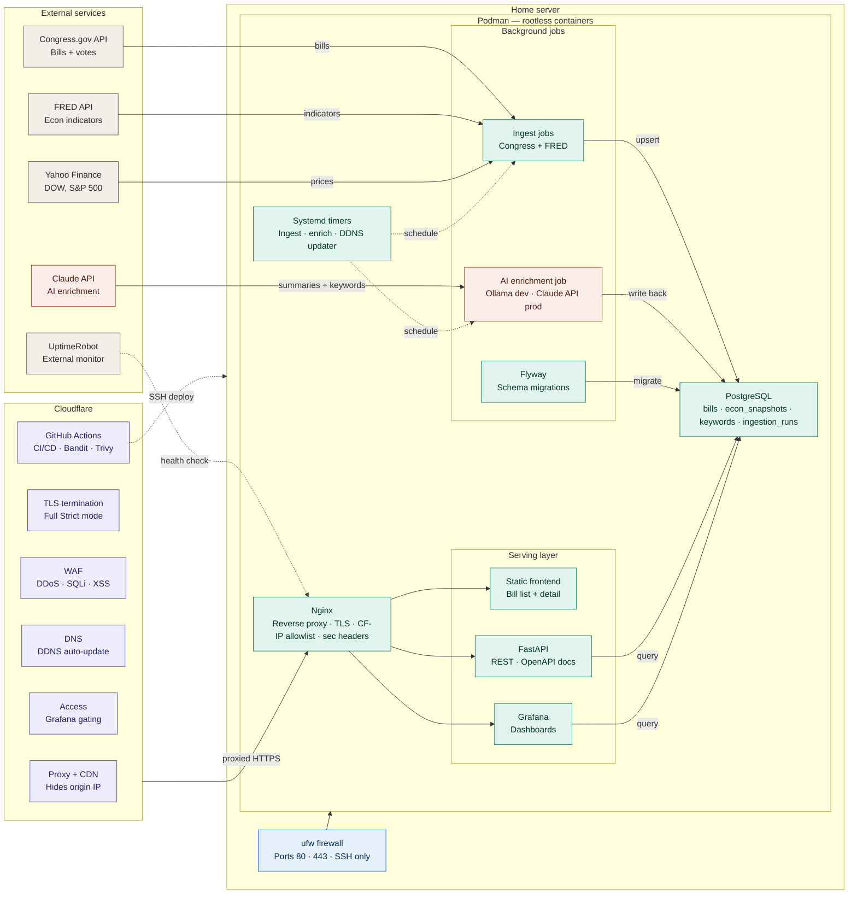

# Capital Investment — Architecture Diagram

---

## Zone key

| Zone | Contents |
|---|---|
| External services | APIs and monitors outside your control |
| Cloudflare | Edge proxy, WAF, DNS, TLS termination, CI/CD |
| Home server | Everything you own and operate |
| Podman | All containerized services, rootless |

## Line key

| Line | Meaning |
|---|---|
| Solid arrow | Live data flow |
| Dashed arrow | Scheduled, automated, or deployment trigger |

## Color key

| Color | Meaning |
|---|---|
| Purple | Cloudflare infrastructure |
| Teal | Core services inside Podman |
| Coral | AI layer (Claude API + enrichment job) |
| Gray | External neutral services |
| Blue | Host-level infrastructure (firewall) |